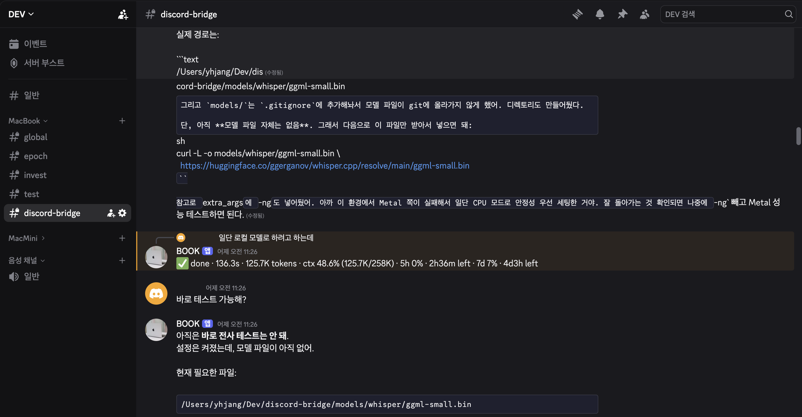

# discord-bridge

Discord workspace router for local coding agents. Bind existing Discord channels
to local project directories, then run Claude Code or Codex CLI from those
channels without giving the bot permission to create or manage your server
structure.

It is designed for mobile-friendly, long-running local agent work: each channel
has a stable `cwd`, provider, session state, queue, attachments, and usage
status.

## Architecture

One bot process, one Discord guild, N existing channels → N local workspaces.
Each workspace maps a Discord `channel_id` to a local `cwd` and provider
(`claude` or `codex`). Each conversational turn spawns the provider CLI as a
subprocess, streams output back to Discord, and keeps session/thread IDs in
`state_file` when configured.

The bridge intentionally stays close to local CLI behavior: Claude Code uses
the local OAuth subscription, and Codex uses local CLI configuration plus the
workspace execution policy in `config.json`.

## Positioning

This is a small router for people who already have:

- local projects checked out on a machine they control
- existing Discord channels they want to use as persistent project rooms
- Claude Code and/or Codex CLI authenticated locally
- a need to send prompts, files, voice messages, and long-running agent output
  from Discord while away from the keyboard

The bridge intentionally stays narrow: each Discord channel maps to one local
workspace with its own `cwd`, provider, session state, queue, attachments, and
usage status. The bot only operates inside channels you bind in `config.json`,
so it does not need permission to create or manage your server structure.

## Why It Helps

- **Channel-bound workspaces**: each Discord channel can be a persistent project
  room with its own local `cwd`, provider, session state, queue, attachments,
  and usage status.
- **Project switching without context mixing**: moving between Discord channels
  moves between local projects, so prompts for one repo do not land in another
  repo's shell or session.
- **Remote workspace expansion**: after the bridge is running, an authorized
  operator can ask an existing mapped workspace to run the binding helper, add a
  new channel-to-folder mapping, and apply it with `/reload` without SSH access
  to the host.
- **Local-only routing details**: Discord channel IDs and workspace paths live in
  `config.json`, which is gitignored. The public repo can show the workflow
  without publishing a real server's routing table.

## Example



A mapped Discord channel works as a persistent project room. The bridge streams
local agent output back into Discord, keeps the workspace context attached to
the channel, and can turn voice messages or file attachments into normal agent
prompts.

## Quick Start

```sh
npm install
cp config.example.json config.json
chmod 600 config.json
```

Create a Discord app and invite its bot first. The full bot setup checklist is
in [Discord Setup](#discord-setup).

Then edit `config.json`:

- set `discord.bot_token`
- set `discord.guild_id`
- set `discord.user_allowlist`
- map at least one initial workspace to a Discord `channel_id`, local `cwd`, and
  optional `provider`

Build and start:

```sh
npm run build
npm start
```

When the bot is online, run `/list` or `/status` in Discord. In a mapped
workspace channel, send a normal message to start a Claude or Codex turn.
After that first mapped channel is available, authorized users can add more
workspace channels from Discord with `/bind`.

The optional `state_file` key stores resumable Claude session IDs. Use an absolute path outside the repo, such as the Application Support path shown in `config.example.json`.

Long-running turns can be tuned with `claude.timeout` and `codex.timeout` in `config.json`. Values are milliseconds; `1800000` means 30 minutes.

For bridge-launched Codex sessions, runtime execution policy is controlled by
`codex.sandbox_mode` and `codex.approval_policy`. Review these settings before
running the bridge in channels shared with other users.

## Discord Setup

This bridge is a guild-installed Discord bot. It connects through the Discord
Gateway, registers guild slash commands on startup, listens in configured text
channels, and only accepts messages from users listed in
`discord.user_allowlist`.

Official Discord references:

- [Discord app quick start](https://docs.discord.com/developers/quick-start/getting-started)
- [OAuth2 and permissions](https://docs.discord.com/developers/platform/oauth2-and-permissions)
- [Application commands](https://docs.discord.com/developers/interactions/application-commands)
- [Message content and attachments](https://docs.discord.com/developers/resources/message)

### 1. Create the app and bot

1. Open <https://discord.com/developers/applications>.
2. Create an application.
3. Open the app's **Bot** page.
4. Reset or copy the bot token and put it in `discord.bot_token`.

Treat the bot token like a password. Keep it in `config.json`, do not commit it,
and regenerate it if it was ever pasted somewhere public.

### 2. Enable required intents

On the app's **Bot** page, enable:

- **Message Content Intent**

The bridge can register slash commands without message content access, but
normal prompts and Discord voice messages depend on message objects containing
`content` and `attachments`.

The code connects with these Gateway intents:

- `Guilds`
- `GuildMessages`
- `MessageContent`

### 3. Configure installation

On the app's **Installation** page, use a guild/server install link.

Use these scopes:

- `bot`
- `applications.commands`

Recommended bot permissions:

- View Channels
- Send Messages
- Embed Links
- Attach Files
- Read Message History

The bot does not need Administrator or Manage Channels for the default workflow.
Create channels yourself and bind them either in `config.json` or, after the
bridge is running, with `/bind`.

### 4. Invite the bot

Copy the install link from the Developer Portal, open it in a browser, and add
the app to your Discord server.

The account installing the bot needs permission to add apps to that server. If
the bot appears in the member list, the install worked.

### 5. Copy Discord IDs

Enable Discord Developer Mode:

`User Settings` -> `Advanced` -> `Developer Mode`

Then copy these IDs for the initial config:

- server ID -> `discord.guild_id`
- your user ID -> `discord.user_allowlist`
- at least one workspace channel ID -> `workspaces[].channel_id`

For example:

```json
{
  "discord": {
    "bot_token": "YOUR_DISCORD_BOT_TOKEN_HERE",
    "guild_id": "123456789012345678",
    "user_allowlist": ["234567890123456789"],
    "notify_channel_name": "discord-bridge"
  },
  "workspaces": [
    {
      "name": "operator",
      "channel_id": "345678901234567890",
      "cwd": "/Users/YOUR_USERNAME/Dev",
      "provider": "codex"
    }
  ]
}
```

`notify_channel_name` is optional. If a channel with that name exists and the
bot can send messages there, it posts a startup notice.

### 6. First Discord test

Start the bridge:

```sh
npm run build
npm start
```

Then in Discord:

1. Run `/list` to confirm the bot sees the configured workspaces.
2. Run `/status` in a mapped channel.
3. Send a normal message in that mapped channel.
4. Create another text channel and run `/bind provider:codex` there to add it
   without copying a channel ID.

If slash commands work but normal messages do not, check Message Content Intent,
channel permissions, and `discord.user_allowlist`.

## Providers

`provider: "claude"` runs Claude Code through the local `claude` CLI. This uses
your local Claude Code authentication and subscription quota; this project does
not use the Anthropic SDK or API keys.

Claude can pause selected tool calls for Discord approval. The recommended
Claude setup is `permission_mode: "default"` with `claude.approval.enabled: true`,
as shown in `config.example.json`. The bridge uses Claude Code's
`PreToolUse` defer/resume flow, so approving a Discord button resumes the exact
paused tool call.

Set `claude.approval.enabled: false` when you do not want bridge-managed
approval buttons. In that mode the bridge does not inject its approval hook; use
it with `bypassPermissions`, with your own Claude policy, or when temporarily
disabling Discord approval handling.

`provider: "codex"` runs Codex through the local `codex` CLI. Runtime execution
policy is controlled by `codex.sandbox_mode` and `codex.approval_policy` in
`config.json`.

Set a default provider per workspace. You can also use `/new claude` or
`/new codex` to start a specific provider in a mapped channel.

## Using It

Use one Discord text channel per workspace. A workspace is active only when the
channel ID is present in `config.json`, and only users listed in
`discord.user_allowlist` can start turns.

In a mapped channel:

1. Send a normal Discord message to prompt the workspace's current provider.
2. Attach files when the agent needs to inspect them. Attachments are saved
   under `.discord-attachments/` and passed to the provider with the prompt.
3. Send more messages while a turn is running to queue follow-up prompts. The
   bridge delivers them after the current turn finishes.
4. Use `/interrupt` if the current turn should stop but the session should stay
   available.
5. Use `/compact` when a long-running session should be summarized into a fresh
   session.

Config changes to workspace mappings can usually be applied with `/reload`.
Changes to `discord.bot_token` or `discord.guild_id` require a process restart.

## Agent Skills

The repo includes optional agent skills for sending generated files back to
Discord through the bridge attachment outbox:

- `.codex/skills/discord-bridge-attachments`
- `.claude/skills/discord-bridge-attachments`

These skills are not required to run the bot. They are helper instructions for
Codex or Claude sessions running inside discord-bridge. When an agent creates a
screenshot, image, report, or log bundle, the skill registers the absolute file
path in `DISCORD_ATTACH_OUTBOX_DIR`; the bridge then uploads the file to Discord
after the turn finishes.

## Voice Input

Voice input is optional. When `voice.enabled` is true, audio attachments such as
Discord voice messages are downloaded, transcribed, and inserted into the normal
prompt flow before the provider CLI is invoked.

One tested local transcription setup on macOS uses Homebrew:

```sh
brew install ffmpeg whisper-cpp
mkdir -p models/whisper
curl -L \
  https://huggingface.co/ggerganov/whisper.cpp/resolve/main/ggml-small.bin \
  -o models/whisper/ggml-small.bin
```

Homebrew installs the CLI as `whisper-cli`. The model file is not included by
Homebrew; whisper.cpp expects a GGML `.bin` model. For Korean, use multilingual
models such as `ggml-small.bin` or `ggml-medium.bin`, not `.en` models.

The local provider runs `ffmpeg` first, then `whisper-cli`:

```json
"voice": {
  "enabled": true,
  "provider": "local",
  "language": "ko",
  "local": {
    "binary": "/opt/homebrew/bin/whisper-cli",
    "model": "/Users/YOUR_USERNAME/Dev/discord-bridge/models/whisper/ggml-small.bin",
    "ffmpeg_binary": "/opt/homebrew/bin/ffmpeg",
    "extra_args": [
      "--prompt",
      "한국어 음성 명령입니다. 테스트 메시지, 현재 상태 확인, 파일 수정, 빌드, 재시작 같은 짧은 개발 작업 요청이 들어옵니다."
    ]
  }
}
```

Test it by sending a Discord voice message in a mapped channel. If the message
contains only audio, a successful transcript becomes the prompt. If both text
and audio are present, the transcript is appended to the text prompt.

For a shared or remote transcription server, enable the local server on the
machine that has `ffmpeg`, `whisper-cli`, and the model file:

```json
"voice": {
  "enabled": true,
  "provider": "local",
  "local": {
    "binary": "/opt/homebrew/bin/whisper-cli",
    "model": "/Users/YOUR_USERNAME/Models/whisper/ggml-small.bin",
    "ffmpeg_binary": "/opt/homebrew/bin/ffmpeg"
  },
  "server": {
    "enabled": true,
    "host": "0.0.0.0",
    "port": 8787,
    "token": "SHARED_TOKEN"
  }
}
```

Then point another bridge instance at it:

```json
"voice": {
  "enabled": true,
  "provider": "http",
  "http": {
    "url": "http://TRANSCRIBE_HOST.local:8787/transcribe",
    "token": "SHARED_TOKEN"
  }
}
```

Use `concurrency: 1` for a shared transcription server unless you have verified the
machine can handle overlapping transcriptions. Non-loopback voice servers must
set `voice.server.token`.

### Workspace mapping

Each workspace has a fixed `cwd`, such as `/Users/YOUR_USERNAME/Dev/frontend-app`,
and maps to one Discord channel. The provider runs from that configured
directory for every turn in the workspace, and the session/thread ID is
persisted across restarts through `state_file`.

A broad workspace such as `/Users/YOUR_USERNAME/Dev` can be useful as an
operator channel. The single-instance lockfile lives next to `state.json`.

## Slash commands

- `/bind` — bind the current text channel to a local workspace
- `/new` — start a session in the current channel
- `/compact` — summarize the current session into a fresh one
- `/end` — end the current session
- `/kill` — force kill without saving (requires confirmation)
- `/interrupt` — stop the current running turn without ending the session
- `/queue list` — show queued follow-up messages
- `/queue cancel` — remove one queued follow-up message
- `/queue clear` — clear all queued follow-up messages
- `/usage` — show provider usage for the current workspace
- `/status` — show current channel's session state
- `/list` — show all workspaces
- `/reload` — reload workspace mappings from `config.json`
- `/unbind` — remove the current channel workspace binding
- `/help`

## Binding and unbinding channels

The recommended flow is the Discord slash command:

```text
/bind provider:codex
```

Run it inside the text channel you want to bind. The bridge derives the
workspace name from the current channel, previews the target `cwd`, and waits
for an ephemeral Apply/Cancel confirmation. Applying the bind creates the local
workspace directory if needed, backs up `config.json`, writes the new workspace
entry, and reloads config without requiring a bot restart.

Useful `/bind` options:

- `provider` — `codex` or `claude`; defaults to `codex`
- `dev_root` — parent directory for generated workspace folders; defaults to
  `~/Dev`
- `name` — workspace name; defaults to the Discord channel name
- `cwd` — workspace directory; relative paths are resolved under `dev_root`

To remove a binding, run this from the bound channel:

```text
/unbind
```

`/unbind` removes the workspace entry from `config.json`, writes a backup, and
reloads config. It does not delete files from disk. If a session is running or
has queued prompts, end or kill the session before unbinding.

### CLI binding fallback

Create the Discord channel manually, copy its channel ID, then dry-run the binding:

```sh
npm run bind-workspace -- --channel-id CHANNEL_ID
```

The script fetches the real Discord channel name and binds it as a workspace with
`cwd` set to `~/Dev/<channel-name>` and `provider` set to `codex` by default.
If the dry run looks right, apply it:

```sh
npm run bind-workspace -- --channel-id CHANNEL_ID --apply
```

Then run `/reload` in Discord to activate the new workspace without restarting
the bot.

The CLI helper accepts a channel ID explicitly. Prefer `/bind` for normal use
because it uses the current Discord channel context and does not require pasting
raw Discord IDs.

The channel name is only used when binding. After that, routing is based on
`channel_id`, so renaming the Discord channel does not automatically rename the
workspace or move its `cwd`.

## Requirements

- Node.js 22+
- `claude` CLI authenticated locally for Claude workspaces
- `codex` CLI authenticated locally for Codex workspaces
- `ffmpeg` and `whisper-cli` for local voice transcription

## Platform Support

This project is actively used on macOS. Windows has not been verified yet.

The core bridge is a Node.js application, so other platforms may work with the
right provider CLI setup. The included LaunchAgent, `caffeinate`, Homebrew, and
`/Users/...` examples are macOS-oriented and should be adapted or ignored on
other platforms.

## Optional: macOS launchd + tmux

For a long-running personal bridge on macOS, this repo includes a LaunchAgent
template that starts a short-lived supervisor. The supervisor keeps the actual
bot inside a tmux session, which avoids macOS launchd killing long-running
background jobs as inefficient.

Create the log directory:

```sh
mkdir -p ~/Library/Logs/discord-bridge
```

Install the user LaunchAgent:

```sh
cp launchd/com.example.discord-bridge.plist ~/Library/LaunchAgents/
chmod 600 ~/Library/LaunchAgents/com.example.discord-bridge.plist
```

Edit the copied plist and replace `/Users/YOUR_USERNAME` plus the
`com.example...` label with your local username/label. Ensure `config.json`
exists with `discord.bot_token` populated (`chmod 600 config.json` recommended).

Start the service:

```sh
launchctl bootstrap gui/$(id -u) ~/Library/LaunchAgents/com.example.discord-bridge.plist
```

Check status:

```sh
launchctl print gui/$(id -u)/com.example.discord-bridge
```

Unload the service:

```sh
launchctl bootout gui/$(id -u)/com.example.discord-bridge
```

Follow logs:

```sh
tail -f ~/Library/Logs/discord-bridge/stderr.log
```

### Keep a Mac laptop awake with the lid closed

On a laptop host, closing the lid triggers maintenance sleep and the Discord gateway heartbeat drops. A sibling LaunchAgent runs `caffeinate -dims` at login so the system stays awake while the bridge is online.

```sh
cp launchd/com.example.caffeinate.plist ~/Library/LaunchAgents/
chmod 600 ~/Library/LaunchAgents/com.example.caffeinate.plist
launchctl bootstrap gui/$(id -u) ~/Library/LaunchAgents/com.example.caffeinate.plist
```

## Security Notes

- `config.json` contains your Discord bot token and is gitignored.
- Set `chmod 600 config.json`.
- Keep `state_file` outside the repo.
- Review `codex.sandbox_mode`, `codex.approval_policy`, Claude permission mode,
  and `claude.approval` before using the bridge in shared Discord channels.
- The default workflow binds existing channels by ID and does not require the
  bot to create, rename, or delete channels.

## Troubleshooting

If the bot starts but slash commands do not appear, confirm the app was installed
with the `applications.commands` scope, `discord.guild_id` is correct, and the
process restarted after changing the token or guild ID.

If slash commands work but normal messages are ignored, check Message Content
Intent, `discord.user_allowlist`, and channel permissions. The bot needs to see
the channel, read message history, and send messages.

If a workspace command says the channel is not mapped, copy the channel ID again,
update `workspaces[].channel_id`, then run `/reload`. For new channels, prefer
running `/bind` from the channel itself.

If local voice transcription fails, check that `voice.local.binary`,
`voice.local.ffmpeg_binary`, and `voice.local.model` are absolute paths that
exist on the machine running the bridge.

If launchd starts the bridge but provider CLIs are not found, use absolute paths
for `claude.binary`, `codex.binary`, `voice.local.binary`, and
`voice.local.ffmpeg_binary`, or adjust the LaunchAgent environment.

## License

Apache License 2.0. See [LICENSE](LICENSE).
